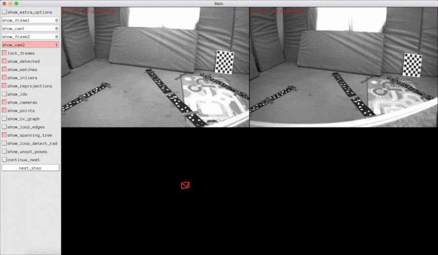

## Vision-based ORB SLAM



In this project we implemented a real-time stereo-camera SLAM algorithm to demonstrate the key components contained in many simple vision-based SLAM systems and to illustrate its benefits over visual odometry. We use sparse indirect methods to find feature correspondences and focus on algorithmic simplicity while ensuring real-time operation. We borrow concepts introduced in [3] including a covisibility graph to store spacially-related keyframes and landmarks, a tracking thread to localize the camera, a local mapping thread to maintain well-determined landmarks and a loop closing thread to associate spatially related keyframes separated far apart in time.

See full report [here](/docs/slam.pdf).

## Dependencies

* [ceres-solver](https://github.com/ceres-solver/ceres-solver)
* [Sophus](https://github.com/strasdat/Sophus)
* [eigen](https://gitlab.com/libeigen/eigen)
* [OpenCV](https://github.com/opencv/opencv)
* [OpenGV](https://laurentkneip.github.io/opengv/)
* [Pangilin](https://github.com/stevenlovegrove/Pangolin)
* [CMake](http://www.cmake.org/cmake/resources/software.html)

## Build and Run

Create a build folder and run cmake

```
mkdir build && cd build
cmake ..
```

### Calibrate Camera Model

```
./build/calibration --dataset -path data/euroc_calib/ --cam-model ds
```

See `include/camera_models.h` for available camera models.

### Run SLAM

```
./build/slam --cam-model ds
```


## Credits

### Vision-based Navigation Practical

This code is based on a prior codebase written by instructors Vladyslav Usenko and Nikolaus Demmel for the practical course "Vision-based Navigation" (IN2106) taught at the Technical University of Munich.

It was originally developed for the winter term 2018.

### License

The code for this practical course is provided under a BSD 3-clause license. See the LICENSE file for details.

Parts of the code (`include/tracks.h`, `include/union_find.h`) are adapted from OpenMVG and distributed under an MPL 2.0 licence.

Parts of the code (`include/local_parameterization_se3.hpp`, `src/test_ceres_se3.cpp`) are adapted from Sophus and distributed under an MIT license.

Note also the different licenses of thirdparty submodules.

## References
1. Good features to track. In 1994 Proceedings of IEEE Conference on Computer Vision and Pattern Recognition, pages 593–600, June 1994.
2. Cesar Cadena, Luca Carlone, Henry Carrillo, Yasir Latif, Davide Scaramuzza, Jos ́e Neira, Ian D. Reid, and John J. Leonard. Simultaneous localization and mapping: Present, future, and the robust-perception age. CoRR, abs/1606.05830, 2016.
3. Raul Mur-Artal, J. M. M. Montiel, and Juan D. Tard ́os. ORB-SLAM: a versatile and accurate monocular SLAM system. CoRR, abs/1502.00956, 2015.
4. Raul Mur-Artal and Juan D. Tard ́os. ORB-SLAM2: an open-source SLAM system for monocular, stereo and RGB-D cameras. CoRR, abs/1610.06475, 2016.
5. E. Rublee, V. Rabaud, K. Konolige, and G. Bradski. Orb: An efficient alternative to sift or surf. In 2011 International Conference on Computer Vision, pages 2564–2571, Nov 2011.
6. Vladyslav C. Usenko, Nikolaus Demmel, and Daniel Cremers. The double sphere camera model. CoRR, abs/1807.08957, 2018.